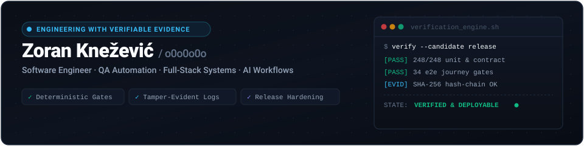

  

&nbsp;

&nbsp;

&nbsp;

 

---

 

## ⚡ Engineering Focus & Philosophy

I build and harden software systems across **web, desktop, native runtimes and automated infrastructure**.  
My primary engineering focus is transforming development from guesswork into verifiable certainty:  
creating **deterministic tests, reproducible bug isolation, tamper-evident evidence, and automated release gates**.

 

> [!NOTE]
> **Core Engineering Standard: Proof Over Guesswork**  
> Every defect candidate adheres to: **Reproduce → Isolate → Fix → Verify Candidate**.  
> Explicit states are prioritized over opaque green builds: `PASS` · `FAIL` · `FLAKY` · `BLOCKED` · `NOT TESTED`.

 

---

 

## 🛡️ Quality Engineering & Reliability Practice

*Production-grade testing matrices, reproducible bug isolation, and deterministic release gates.*

 

| Area | Tools & Methodologies | Quality Output |
| :--- | :--- | :--- |
| **Browser & E2E** | Playwright, cross-browser matrices, visual regression | Flake-resistant user journeys |
| **Unit & Component** | Vitest, xUnit, Testing Library, contract testing | Millisecond regression coverage |
| **Load & Runtime Smoke** | k6, automated API stress tests, runtime assertions | Baseline latency & throughput metrics |
| **CI/CD & Hardening** | GitHub Actions, containerized verification, package acceptance | Deterministic, zero-drift release artifacts |
| **Integrity & Security** | Cryptographic hash-chains, tamper-evident audit trails | Defensible, verifiable system evidence |

 

---

 

## 📂 Featured Systems & Architecture

*Selected production tools, drivers, and automation frameworks.*

 

| Project | Description | Stack & Engineering Signals |
| :--- | :--- | :--- |
| [**Internet Evidence Monitor**](https://github.com/zoxknez/InternetMonitoring) | Local-first network telemetry engine creating tamper-evident evidence for diagnosing outages and filing carrier dispute reports. | `C#` `.NET` `WPF/Avalonia` `xUnit` `Hash-Chain Proofs` `Windows Service` `systemd` |
| [**Real-time Dependency Graph**](https://github.com/zoxknez/Real-time-Dependency-Graph-Analysis-Platform) | Ingestion and graph analysis platform streaming package releases across npm, PyPI and crates.io to identify breaking API changes. | `Rust` `GraphQL` `Next.js` `PostgreSQL` `Memgraph` `Qdrant` `Redpanda` `Playwright` `k6` |
| [**HP ScanJet G2710 Modern Driver**](https://github.com/zoxknez/driver-HP-ScanJet-G2710) | Modern Windows scanning stack for legacy hardware with WIA/TWAIN support, simulator-driven development and qualification gates. | `C++` `CMake` `.NET 10` `WPF` `xUnit` `PowerShell` `Hardware Qualification` |
| [**AI Coding Rules & Guardrails**](https://github.com/zoxknez/ai-coding-rules) | Operating discipline and boundary enforcement framework for AI coding agents with automated verification gates. | `AI Engineering Workflows` `Scope Control` `Security Guardrails` `QA Strategy` |
| [**Ultimate Production Audit Library**](https://github.com/zoxknez/ultimate-prompting) | Bilingual EN/SR evidence-first audit system for production readiness, remediation, incidents and recovery across diverse stacks. | `Python Validation Tools` `Deterministic Composition` `Regression/Eval Harness` `CI` |

 

---

 

## 🛠️ Technical Arsenal

 

#### Languages & Core Runtimes

 

#### Quality Engineering & Automated Testing

 

#### Frameworks & Systems Architecture

 

#### DevOps, Cloud & Delivery

 

---

 

## ⚙️ Operating Principles

 

| # | Principle | Engineering Mandate |
| :---: | :--- | :--- |
| `01` | **Reproduce First** | Root cause discovery over speculative patches |
| `02` | **Risk-Based QA** | Prioritize test coverage according to failure blast radius |
| `03` | **Evidence Gates** | No feature candidate is complete without verifiable test telemetry |
| `04` | **Minimal Surfaces** | Keep architecture scoped, strictly reviewable and easily reversible |
| `05` | **Pragmatic AI** | Leverage AI for engineering velocity; retain human rigor for correctness |

 

---

 

&nbsp;

&nbsp;

&nbsp;

 

Designed &amp; Engineered by <strong>Zoran Knežević</strong> · Belgrade, Serbia (Remote)

