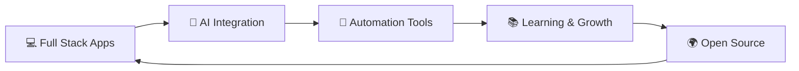
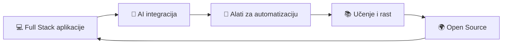

<!-- Language Selector -->
<div align="right">
  <a href="#english">🇬🇧 English</a> | <a href="#serbian">🇷🇸 Српски</a>
</div>

<a name="english"></a>

# 👋 Hello, I'm o0o0o0o!

<div align="center">
  <a href="https://readme-typing-svg.demolab.com?font=Fira+Code&pause=1000&color=1F6FEB&center=true&vCenter=true&width=600&lines=Full+Stack+Developer+%7C+Software+Engineer;Open+Source+Enthusiast+%26+Contributor;AI-Powered+Development+Advocate;Automation+%26+DevOps+Specialist;Problem+Solver+%7C+Code+Craftsman">
    
  </a>
</div>

<div align="center">
  
  [](https://mojportfolio.vercel.app)
  [](https://x.com/KoronVirus)
  [](https://github.com/o0o0o0o)
  
</div>

---

## 🌟 About Me

Professional software engineer with a passion for **open source**, **automation**, and **AI-powered coding solutions**. I actively contribute to various projects and love sharing knowledge with the community. My focus is on building scalable, maintainable solutions while embracing modern development practices.

### 🎯 Quick Facts

```typescript
const developer = {
  name: "o0o0o0o",
  role: "Full Stack Developer",
  location: "🌍 Remote",
  focus: ["Web Development", "Automation", "AI Integration", "DevOps"],
  currentlyLearning: ["Advanced AI Tools", "Cloud Architecture", "System Design"],
  openToCollaborate: true,
  funFact: "I turn coffee into code ☕ → 💻"
};
```

---

## 🛠️ Tech Stack & Skills

### 💻 Programming Languages

<div align="center">


</div>

### 🎨 Frontend Development

<div align="center">


</div>

### ⚙️ Backend & Database

<div align="center">


</div>

### 🔧 DevOps & Tools

<div align="center">


</div>

### 🤖 AI & Machine Learning

<div align="center">


</div>

### 📦 Core Competencies

<table align="center">
  <tr>
    <td align="center" width="25%">
      
      <br><strong>AI-Powered Development</strong>
      <br><sub>Leveraging AI tools for code optimization and intelligent solutions</sub>
    </td>
    <td align="center" width="25%">
      
      <br><strong>Automation</strong>
      <br><sub>PowerShell, Bash scripting, CI/CD pipelines</sub>
    </td>
    <td align="center" width="25%">
      
      <br><strong>Open Source</strong>
      <br><sub>Active contributor to community projects</sub>
    </td>
    <td align="center" width="25%">
      
      <br><strong>Full Stack</strong>
      <br><sub>End-to-end application development</sub>
    </td>
  </tr>
</table>

---

## 📊 GitHub Statistics

<div align="center">
  
  
</div>

<div align="center">
  
</div>

<div align="center">
  
</div>

---

## 🚀 Featured Projects

<div align="center">

| 🌟 Project | 📝 Description | 💻 Tech Stack | ⭐ Stars |
|-----------|---------------|--------------|----------|
| **[ai-coding-rules](https://github.com/o0o0o0o/ai-coding-rules)** | Comprehensive AI coding best practices and guidelines | Shell, Markdown |  |
| **[KorisneWindowsPowerShellSkripte](https://github.com/o0o0o0o/KorisneWindowsPowerShellSkripte)** | Useful PowerShell scripts for Windows automation | PowerShell |  |
| **[Twitter-X-Block-Manager](https://github.com/o0o0o0o/Twitter-X-Block-Manager)** | Advanced block management tool for Twitter/X | JavaScript |  |
| **[post-vibe-audit](https://github.com/o0o0o0o/post-vibe-audit)** | Social media post analysis and audit tool | Python |  |
| **[metabot](https://github.com/o0o0o0o/metabot)** | Intelligent bot with metaprogramming capabilities | JavaScript |  |
| **[legalniservisidownloadvideo](https://github.com/o0o0o0o/legalniservisidownloadvideo)** | Video download and processing toolkit | Python |  |

</div>

---

## 💼 What I'm Currently Working On

<div align="center">



</div>

- 🔨 Building **scalable full-stack applications** with modern frameworks
- 🤖 Experimenting with **AI-powered development** tools and workflows
- 📚 Mastering **cloud architecture** and **microservices** patterns
- 🔧 Creating **automation tools** for enhanced productivity
- 🌍 Contributing to **open source** projects and communities
- 📝 Writing **technical documentation** and sharing knowledge

---

## 📈 Contribution Activity

<div align="center">


</div>

<div align="center">

### 🎯 **695+ contributions** in the last year! 🎉

</div>

---

## 💡 Philosophy & Motivation

<div align="center">

> *"Code is poetry written in logic. Every commit is a verse, every project a masterpiece in progress."*

> *"The best code is not just functional—it's elegant, maintainable, and tells a story."*

</div>

---

## 🤝 Let's Connect & Collaborate!

<div align="center">

### Interested in collaboration? Let's build something amazing together! 🚀

<table>
  <tr>
    <td align="center">
      <a href="https://mojportfolio.vercel.app">
        
        <br><strong>Portfolio</strong>
      </a>
    </td>
    <td align="center">
      <a href="https://x.com/KoronVirus">
        
        <br><strong>Twitter</strong>
      </a>
    </td>
    <td align="center">
      <a href="https://github.com/o0o0o0o">
        
        <br><strong>GitHub</strong>
      </a>
    </td>
    <td align="center">
      <a href="mailto:contact@example.com">
        
        <br><strong>Email</strong>
      </a>
    </td>
  </tr>
</table>

[](https://mojportfolio.vercel.app)

</div>

---

<div align="center">

### Thank you for visiting my profile! 👋

*I regularly publish new projects and updates. Feel free to explore and star repositories you find interesting!*

<p>
  
</p>

**⭐ If you like my work, consider giving a star to my repositories!**

</div>

---
---
---

<a name="serbian"></a>

# 👋 Pozdrav, ja sam o0o0o0o!

<div align="center">
  <a href="https://readme-typing-svg.demolab.com?font=Fira+Code&pause=1000&color=1F6FEB&center=true&vCenter=true&width=600&lines=Full+Stack+Developer+%7C+Softverski+Inženjer;Open+Source+Entuzijasta+%26+Kontributor;AI-Powered+Development+Advokat;Automatizacija+%26+DevOps+Specijalista;Problem+Solver+%7C+Code+Craftsman">
    
  </a>
</div>

<div align="center">
  
  [](https://mojportfolio.vercel.app)
  [](https://x.com/KoronVirus)
  [](https://github.com/o0o0o0o)
  
</div>

---

## 🌟 O meni

Profesionalni softverski inženjer sa strašću za **open source**, **automatizacijom** i **AI-powered coding rešenjima**. Aktivno doprinosim različitim projektima i volim da delim znanje sa zajednicom. Moj fokus je na izgradnji skalabilnih, održivih rešenja uz prihvatanje modernih razvojnih praksi.

### 🎯 Brze činjenice

```typescript
const developer = {
  ime: "o0o0o0o",
  uloga: "Full Stack Developer",
  lokacija: "🌍 Remote",
  fokus: ["Web Development", "Automatizacija", "AI Integracija", "DevOps"],
  trenutnoUčim: ["Napredni AI Alati", "Cloud Arhitektura", "System Design"],
  otvorenZaSaradnju: true,
  zanimljivost: "Pretvarам kafu u kod ☕ → 💻"
};
```

---

## 🛠️ Tehnološki stek i veštine

### 💻 Programski jezici

<div align="center">


</div>

### 🎨 Frontend razvoj

<div align="center">


</div>

### ⚙️ Backend i baze podataka

<div align="center">


</div>

### 🔧 DevOps i alati

<div align="center">


</div>

### 🤖 AI i mašinsko učenje

<div align="center">


</div>

### 📦 Ključne kompetencije

<table align="center">
  <tr>
    <td align="center" width="25%">
      
      <br><strong>AI-Powered razvoj</strong>
      <br><sub>Korišćenje AI alata za optimizaciju koda i inteligentna rešenja</sub>
    </td>
    <td align="center" width="25%">
      
      <br><strong>Automatizacija</strong>
      <br><sub>PowerShell, Bash skriptovanje, CI/CD pipeline-ovi</sub>
    </td>
    <td align="center" width="25%">
      
      <br><strong>Open Source</strong>
      <br><sub>Aktivan kontributor projektima zajednice</sub>
    </td>
    <td align="center" width="25%">
      
      <br><strong>Full Stack</strong>
      <br><sub>Razvoj aplikacija od početka do kraja</sub>
    </td>
  </tr>
</table>

---

## 📊 GitHub statistika

<div align="center">
  
  
</div>

<div align="center">
  
</div>

<div align="center">
  
</div>

---

## 🚀 Istaknuti projekti

<div align="center">

| 🌟 Projekat | 📝 Opis | 💻 Tehnologije | ⭐ Zvezdice |
|-----------|---------|---------------|-------------|
| **[ai-coding-rules](https://github.com/o0o0o0o/ai-coding-rules)** | Sveobuhvatne AI coding best practices i smernice | Shell, Markdown |  |
| **[KorisneWindowsPowerShellSkripte](https://github.com/o0o0o0o/KorisneWindowsPowerShellSkripte)** | Korisne PowerShell skripte za Windows automatizaciju | PowerShell |  |
| **[Twitter-X-Block-Manager](https://github.com/o0o0o0o/Twitter-X-Block-Manager)** | Napredni alat za upravljanje blokiranjem na Twitter/X | JavaScript |  |
| **[post-vibe-audit](https://github.com/o0o0o0o/post-vibe-audit)** | Alat za analizu i audit postova na društvenim mrežama | Python |  |
| **[metabot](https://github.com/o0o0o0o/metabot)** | Inteligentni bot sa metaprogramiranjem mogućnostima | JavaScript |  |
| **[legalniservisidownloadvideo](https://github.com/o0o0o0o/legalniservisidownloadvideo)** | Alatka za preuzimanje i obradu video sadržaja | Python |  |

</div>

---

## 💼 Šta trenutno radim

<div align="center">



</div>

- 🔨 Izgradnja **skalabilnih full-stack aplikacija** sa modernim framework-ima
- 🤖 Eksperimentisanje sa **AI-powered development** alatima i workflow-ima
- 📚 Savladavanje **cloud arhitekture** i **microservices** paterna
- 🔧 Kreiranje **alata za automatizaciju** za poboljšanu produktivnost
- 🌍 Doprinos **open source** projektima i zajednicama
- 📝 Pisanje **tehničke dokumentacije** i deljenje znanja

---

## 📈 Aktivnost doprinosa

<div align="center">


</div>

<div align="center">

### 🎯 **695+ doprinosa** u poslednjoj godini! 🎉

</div>

---

## 💡 Filozofija i motivacija

<div align="center">

> *"Kod je poezija napisana u logici. Svaki commit je strofa, svaki projekat remek-delo u nastajanju."*

> *"Najbolji kod nije samo funkcionalan—on je elegantan, održiv i priča priču."*

</div>

---

## 🤝 Povežimo se i sarađujmo!

<div align="center">

### Zainteresovani ste za saradnju? Hajde da izgradimo nešto neverovatno zajedno! 🚀

<table>
  <tr>
    <td align="center">
      <a href="https://mojportfolio.vercel.app">
        
        <br><strong>Portfolio</strong>
      </a>
    </td>
    <td align="center">
      <a href="https://x.com/KoronVirus">
        
        <br><strong>Twitter</strong>
      </a>
    </td>
    <td align="center">
      <a href="https://github.com/o0o0o0o">
        
        <br><strong>GitHub</strong>
      </a>
    </td>
    <td align="center">
      <a href="mailto:contact@example.com">
        
        <br><strong>Email</strong>
      </a>
    </td>
  </tr>
</table>

[](https://mojportfolio.vercel.app)

</div>

---

<div align="center">

### Hvala što ste posetili moj profil! 👋

*Redovno objavljujem nove projekte i ažuriranja. Slobodno istražite i dajte zvezdicu repozitorijumima koji vam se sviđaju!*

<p>
  
</p>

**⭐ Ako vam se sviđa moj rad, razmislite o davanju zvezdice mojim repozitorijumima!**

</div>
